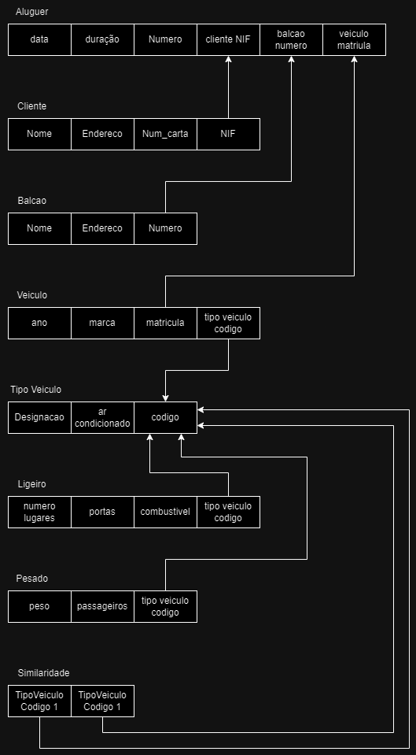
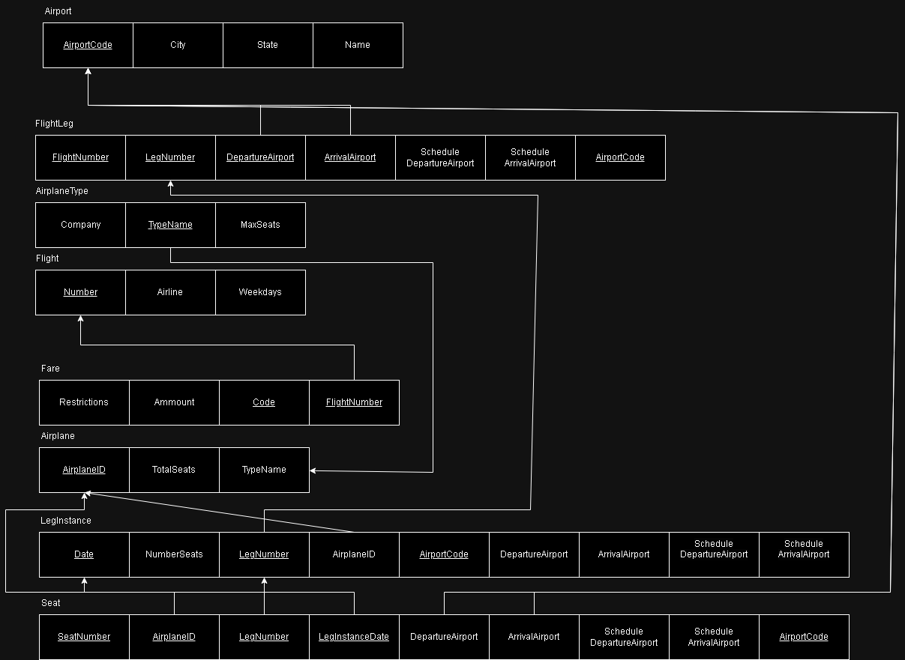
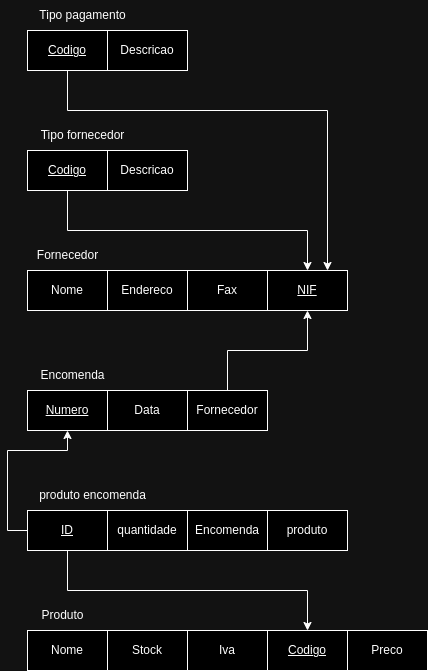
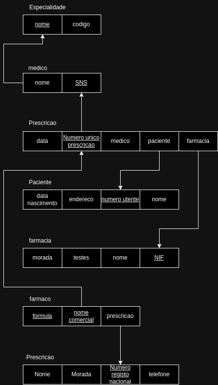
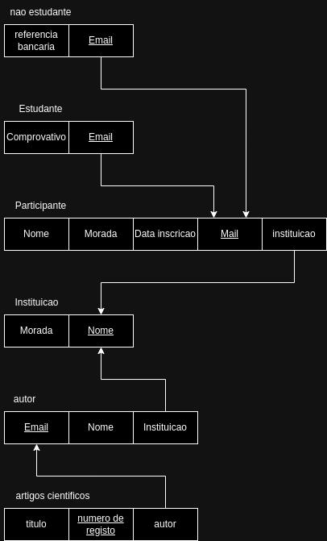
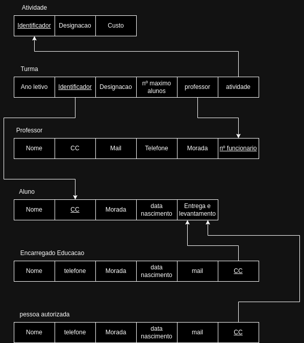

# BD: Guião 3


## ​Problema 3.1
 
### *a)*

```
Ligeiro: TipoVeiculo_Codigo, Combustivel, Portas, NumLugares
Pesado: TipoVeiculo_Codigo, Peso, Passageiro
Tipo_Veiculo: Codigo, Designação, Ar__Condicionado
Similaridade: TipoVeiculo_Codigo1, TipoVeiculo_Codigo2
Veiculo: Matricula, Marca, Ano, TipoVeiculo_Codigo
Cliente: NIF, Nome, Endereco, Num_Carta
Balcao: Nome, Numero, Endereco
Aluguer: Numero, Duracao, Data
```

Ligeiro: <u>ID</u>, <u style="border-bottom: 2px dotted;">TipoVeiculo_Codigo</u>, Combustivel, Portas, NumLugares
Pesado: <u>ID</u>, <u style="border-bottom: 2px dotted;">TipoVeiculo_Codigo</u>, Peso, Passageiro
Tipo_Veiculo: <u>Codigo</u>, Designação, Ar__Condicionado
Similaridade:  <u style="border-bottom: 2px dotted;">TipoVeiculo_Codigo1, TipoVeiculo_Codigo2</u>
Veiculo:<u>matricula</u> marca ano, tipoveiculo_codigo
Cliente: <u>NIF</u> nome endereco num_carta
Balcao: nome <u>numero</u> endereco
Aluguer: <u>numero</u> duracao data, <u style="border-bottom: 2px dotted;">balcao_numero, cliente_NIF, veiculo_matricula</u>


### *b)* 

```
Cliente:
Chaves Candidatas: NIF, NumCarta
Chave Primaria (PK): NIF
Chave(s) Estrangeira(s): Não tem

Balcao:
Chaves Candidatas: Numero
Chave Primaria (PK): Numero
Chave(s) Estrangeira(s): Não tem

Veiculo:
Chaves Candidatas: Matricula
Chave Primaria (PK): Matricula
Chave(s) Estrangeira(s): TipoVeiculo_Codigo

Aluger:
Chaves Candidatas: Numero (Balcao_Numero + Cliente_NIF + Veiculo_Matricula + Data)
Chave Primaria (PK): Numero 
Chave(s) Estrangeira(s): Balcao_Numero, Cliente_NIF, Veiculo_Matricula

Similaridade:
Chaves Candidatas: TipoVeiculo_Codigo1 + TipoVeiculo_Codigo2
Chave Primaria (PK): TipoVeiculo_Codigo1 + TipoVeiculo_Codigo2
Chave(s) Estrangeira(s): TipoVeiculo_Codigo1, TipoVeiculo_Codigo2
```


### *c)* 




## ​Problema 3.2

### *a)*

```
Airport: Airport_Code, City, State, Name
Flight_Leg: Flight_Number, Leg_Number, Departure_Airport, Arrival_Airport, Scheduled_Dep_Time, Schedule_Arr_Time, AirportCode
Airplane_Type: Company, Type_name, Max_seats
Flight: Number, Airline, Weekdays
Fare: Restrictions, Ammount, Code, Flight_Number
Airplane: Airplane_ID, Total_Seats, Type_Name
Leg_Instance: Date, Number_Seats, Leg_Number, AirplaneID, AirportCode, Departure_Airport, Arrival_Airport, Scheduled_Dep_Time, Schedule_Arr_Time
Seat: Seat_Number, Airplane_ID, Leg_Number, LegInstance_Date, Departure_Airport, Arrival_Airport, Scheduled_Dep_Time, Schedule_Arr_Time, Airport_Code
```
Airport: <u>Airport_Code</u>, City, State, Name
Flight_Leg: <u style="border-bottom: 2px dotted;">Flight_Number</u>, <u style="border-bottom: 2px dotted;">Leg_Number</u>,  <u style="border-bottom: 2px dotted;">Departure_Airport, Arrival_Airport</u>, Scheduled_Dep_Time, Schedule_Arr_Time, <u style="border-bottom: 2px dotted;">AirportCode</u>
Airplane_Type: Company, <u>Type_name</u>, Max_seats
Flight: <u>Number</u>, Airline, Weekdays
Fare: Restrictions, Ammount, <u style="border-bottom: 2px dotted;">Code, Flight_Number</u>
Airplane: <u>Airplane_ID</u>, Total_Seats, Type_Name
Leg_Instance: <u style="border-bottom: 2px dotted;">Date</u>, Number_Seats,<u style="border-bottom: 2px dotted;">Leg_Number</u>, AirplaneID, <u style="border-bottom: 2px dotted;">AirportCode</u>, Departure_Airport, Arrival_Airport, Scheduled_Dep_Time, Schedule_Arr_Time
Seat:  <u style="border-bottom: 2px dotted;">Seat_Number</u>,  <u style="border-bottom: 2px dotted;">Airplane_ID</u>,  <u style="border-bottom: 2px dotted;">Leg_Number, LegInstance_Date</u>, Departure_Airport, Arrival_Airport, Scheduled_Dep_Time, Schedule_Arr_Time,  <u style="border-bottom: 2px dotted;">Airport_Code</u>


### *b)* 

```
Airport: 
Chaves Candidatas: Airport_Code
Chaves Primarias (PK): Airport_Code
Chave(s) Estrangeira(s): Não tem

Flight_Leg: 
Chaves Candidatas: Leg_No + Airport_Code_Arrival + Airport_Code_Departure + Flight_Number
Chaves Primarias (PK): Airport_Code + Flight_Number
Chave(s) Estrangeira(s): Airport_Code_Arrival + Airport_Code_Departure

Airplane_Type:
Chaves Candidatas: Type_Name
Chaves Primarias (PK): Type_Name
Chave(s) Estrangeira(s): Não tem

Flight: 
Chaves Candidatas: Number
Chaves Primarias (PK): Number
Chave(s) Estrangeira(s): Não tem

Fare:
Chaves Candidatas: Code + Flight_Number 
Chaves Primarias (PK): Code + Flight_Number 
Chave(s) Estrangeira(s): Flight_Number

Airplane:
Chaves Candidatas: Airplane_ID
Chaves Primarias (PK): Airplane_ID
Chave(s) Estrangeira(s): Airplane_Type

Leg_Instance: 
Chaves Candidatas: Data + Leg_No + Airport_Code_Arrival + Airport_Code_Departure + Flight_Number + AirplaneID
Chaves Primarias (PK):  Leg_No + Airport_Code_Arrival + Airport_Code_Departure + Flight_Number + Data + AirplaneID 
Chave(s) Estrangeira(s): Leg_No + Airport_Code_Arrival + Airport_Code_Departure + Flight_Number + AirplaneID

Seat: 
Chaves Candidatas: Seat_Number + Data + Leg_No + Airport_Code_Arrival + Airport_Code_Departure + Flight_Number + AirplaneID
Chaves Primarias (PK): Data + Leg_No + Airport_Code_Arrival + Airport_Code_Departure + Flight_Number + AirplaneID + Seat
Chave(s) Estrangeira(s): AirplaneID + Data + Leg_No + Airport_Code_Arrival + Airport_Code_Departure + Flight_Number 
```


### *c)* 




## ​Problema 3.3


### *a)* 2.1



### *b)* 2.2



### *c)* 2.3



### *d)* 2.4

